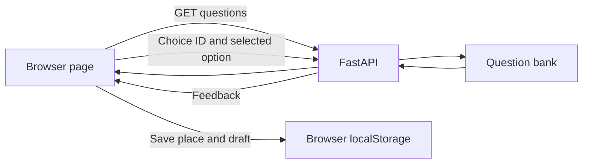

# How this quiz is built

## Structure

| File | Job |
| --- | --- |
| `app/main.py` | Starts the FastAPI app, serves the page, returns questions, and checks multiple-choice answers. |
| `app/questions.py` | Keeps the original 21 questions and combines them with the added curriculum. |
| `app/curriculum.py` | Defines the seven topics and the added Python, SQL, data, service, AI, and statistics questions. |
| `app/static/index.html` | The page structure: topic tabs, one question, hints, feedback, and the end screen. |
| `app/static/styles.css` | The visual layout and small-screen styles. |
| `app/static/app.js` | The learning flow, button actions, retries, review list, and saved place. |
| `requirements.txt` | FastAPI and Uvicorn, needed to run the quiz. |
| `requirements-practice.txt` | Optional packages for trying library exercises in your own Python files. |

## Request flow



For a coding exercise, the browser requests a reference solution using only the question ID. The typed code stays in the browser and is never run by this service. The reference is for your own comparison; other correct solutions are possible.

## Learning algorithm

1. Pick a topic. The browser loads that topic's saved position or starts at its first question.
2. Try an answer or request hints. Hints are shown one at a time.
3. For a multiple-choice answer, the API says whether the choice fits and supplies an explanation. After an incorrect choice, you can retry without a limit or reveal the walkthrough.
4. For code, compare your answer with the reference, syntax note, service context, and common mistake. You can revise your draft repeatedly.
5. Mark the idea understood or save it for more practice. You can continue whenever you are ready.
6. The browser saves the topic, place, answers, hints, drafts, and practice list in `localStorage`. Refreshing restores them on the same browser and port.
7. The end screen offers ideas to revisit. It does not calculate or display a score.

The question order is stable. Each topic and Mixed practice have separate saved progress. Older progress is migrated into Mixed practice, so the existing answers and drafts remain available.

## Adding a question

Add it to `app/curriculum.py` with a unique ID, a topic, a clear prompt, hints, and a beginner-friendly explanation. Multiple-choice questions need plausible options and one correct index. Coding questions need a reference answer plus syntax, service-use, and common-mistake notes. Keep learner code out of the FastAPI process.

### Question quality standards

Write for a beginner who has completed the earlier lessons, but do not assume unstated product or data context. Each question should teach one main idea and describe a realistic task a product or service team might face. For AI service scenarios, name the user or operator, the relevant inputs or data, and the outcome or constraint that matters.

Before adding a question, check that:

- The prompt gives enough context to understand the situation without guessing hidden schema, policy, or terminology.
- The task asks for one clear decision or output and includes the necessary assumptions, examples, and edge behavior.
- Multiple-choice options are all plausible actions a beginner might consider; avoid joke answers, unrelated concepts, and obviously unsafe extremes. Keep one best answer under the stated context.
- The explanation says why the best answer fits the scenario and why the nearest tempting alternative falls short.
- Coding questions include the input/output contract, relevant fixture or library assumptions, and a traceable example. Their staged hints move from problem decomposition to an implementation step.
- Team and AI-service questions reward useful practice: clarify acceptance criteria, define API/data contracts, review evidence, protect data and permissions, test failure cases, and monitor quality, cost, latency, and freshness where relevant.
- A short transfer prompt lets the learner apply the idea after seeing the explanation.

Use a simple 0–2 review score for context, answerability, reasoning value, explanation, and transfer practice (0 missing, 1 partial, 2 clear). Aim for at least 8/10 and require no zero for context or answerability. Keep difficulty gentle by changing one requirement at a time and explaining unfamiliar terms in the prompt or feedback.

## Run it

From `/Users/jd/course-quiz-2026`:

```sh
source .venv/bin/activate
python -m uvicorn app.main:app --host 127.0.0.1 --port 8000
```

Open <http://127.0.0.1:8000>. If `.venv` is unavailable, follow the setup commands in `README.md` first.
